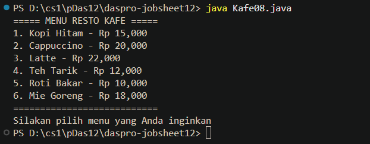
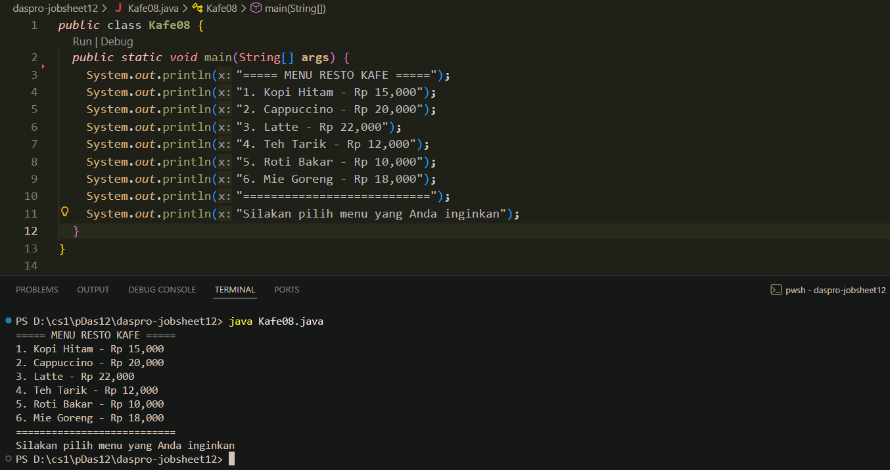
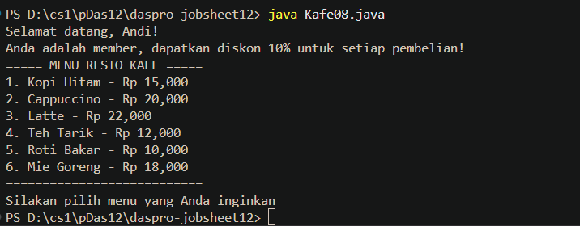
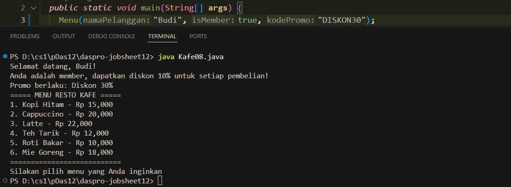
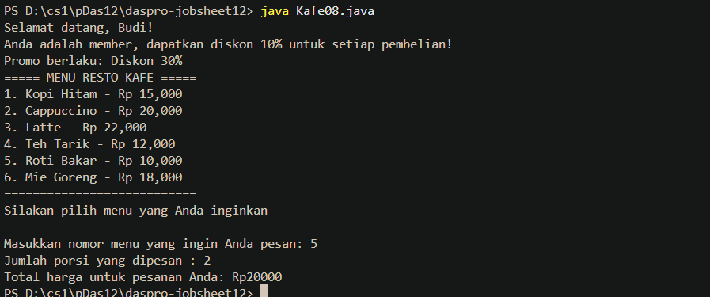

<!-- # TUGAS
### TUGAS 1

Soal:

[Tugas1 / <nama file>.java](<link>)

Contoh output:
<link video / gambar>

### TUGAS 2

Soal:

[Tugas2 / <nama file>.java](<link>)

Contoh output:
<link video / gambar>

### TUGAS 3

Soal:

[Tugas3 / <nama file>.java](<link>)

Contoh output:
<link video / gambar> -->

---

# Daftar_Percobaan
1. [Percobaan 1](#percobaan-1)
- [Pertanyaan](#pertanyaan)
    * [Jawaban](#jawaban)
2. [Percobaan 2](#percobaan-2)
- [Pertanyaan](#pertanyaan-1)
    * [Jawaban](#jawaban-1)
3. [Percobaan 3](#percobaan-3)
- [Pertanyaan](#pertanyaan-2)
    * [Jawaban](#jawaban-2)
4. [Percobaan 4](#percobaan-4)
- [Pertanyaan](#pertanyaan-3)
    * [Jawaban](#jawaban-3)
5. [Percobaan 5](#percobaan-5)
- [Pertanyaan](#pertanyaan-4)
    * [Jawaban](#jawaban-4)

---

## Percobaan 1
[Kondisi awal Kafe08.java (Commit 713c7e8)](https://github.com/okeokke/daspro-jobsheet12/commit/713c7e8e85099268dc0c7f8f820146abe8a655f5)  
Screenshot Inisial :  
  
  
  [Kembali ke #Daftar_Percobaan](#daftar_percobaan)

### Pertanyaan
1. Apakah fungsi tanpa parameter selalu harus bertipe void? 
2. Apakah daftar menu pada program kafe dapat ditampilkan tanpa menggunakan fungsi Menu()?  Modifikasi  kode  program  tersebut  untuk  dapat  menampilkan  daftar  menu tanpa menggunakan fungsi! 
3. Jelaskan keuntungan menggunakan fungsi Menu() dibandingkan menulis semua perintah penampilan menu langsung di dalam fungsi main. 
4. Uraikan secara singkat alur eksekusi program ketika fungsi Menu() dipanggil dari main (mulai dari program dijalankan sampai daftar menu tampil di layar).  
  
[Kembali ke #Daftar_Percobaan](#daftar_percobaan)

### Jawaban
1. Tidak, bisa bertipe data lain, void berarti fungsi dijalankan tetapi tidak ada nilai yang dikembalikan setelah di-call, sedangkan jika ada yang perlu di-return, maka harus dalam sebuah tipe data dan variabel dengan sintaks return di dalam kode fungsi.
2. [Kafe08.java (Commit 371e599)](https://github.com/okeokke/daspro-jobsheet12/commit/371e59938e8e26a411a88493ceed5e155a853a07)  

3. Ibarat mengelompokkan sebagian kode tertentu menjadi sebuah modul bongkar-pasang/lego yang bisa digunakan atau tidak kapan saja tergantung kebutuhan (bersifat lebih modular), membuat kode utama bisa lebih rapih dan lebih mudah dibaca.
4. Program mulai dari fungsi main -> main menjalankan call ke fungsi menu -> program menjalankan isi kode fungsi menu dan mengeluarkan output berdasarkan isi kode fungsi sampai selesai (return void) -> setelah selesai menjalankan fungsi, program kembali ke fungsi main -> program berlanjut sampai selesai.
  

  [Kembali ke #Daftar_Percobaan](#daftar_percobaan)

---

## Percobaan 2
[Kafe08.java (Commit e22fb71)](https://github.com/okeokke/daspro-jobsheet12/commit/e22fb7146a8225b1d5eda3d3f66fd40550da761a)  
Screenshot Inisial:  
  
  
  [Kembali ke #Daftar_Percobaan](#daftar_percobaan)

### Pertanyaan
1. Apakah kegunaan parameter di dalam fungsi?  
2. Jelaskan mengapa pada percobaan ini fungsi **`Menu()`** menggunakan parameter `namaPelanggan` dan `isMember`? 
3. Apakah parameter sama dengan variabel? Jelaskan. 
4. Jelaskan bagaimana cara kerja parameter `isMember` pada fungsi **`Menu()`**. Apa 
perbedaan output ketika isMember bernilai true dan ketika false? 
5. Apa  yang  akan  terjadi  jika  memanggil  fungsi  Menu()  tanpa  menyertakan  parameter `namaPelanggan` dan `isMember`? 
6. Modifikasi kode di atas dengan menambahkan parameter baru **kodePromo (String)**. Jika kodePromo adalah "DISKON50",  tampilkan berikan diskon 50%. Jika kodePromo adalah  "DISKON30",  tampilkan  berikan  diskon  30%.  Jika tidak  ada  kode  promo  yang berlaku, tampilkan kode invalid. 
7. Berdasarkan  fungsi  Menu()  di  atas,  jika  nama  pelanggan  adalah  "Budi",  pelanggan tersebut  member,  dan  menggunakan  kode  promo  "DISKON30",  tuliskan  satu  baris perintah pemanggilan fungsi menu yang benar. 
8. Menurut  Anda, apakah penggunaan parameter `namaPelanggan` dan `isMember` pada fungsi Menu() membuat  program lebih mudah  dibaca  dan  dikembangkan dibandingkan jika nilai-nilai tersebut ditulis langsung di dalam fungsi tanpa parameter? Jelaskan alasan Anda. 
  
  
  [Kembali ke #Daftar_Percobaan](#daftar_percobaan)

### Jawaban
1. Untuk memberi nilai pada variabel yang dibutuhkan dalam suatu fungsi.
2. Karena isi kode pada fungsi membutuhkan/menggunakan 2 variabel tersebut (terletak pada bagian `System.out.println("Selamat datang, "+ namaPelanggan + "!")` dan `if (isMember) {...}`), yang juga bisa membuat kode fungsi lebih fleksibel karena value tidak diatur dalam kode fungsi, tetapi diluarnya, yang lalu 'diumpan' ke dalam eksekusi fungsi tersebut
3. Hampir sama, parameter kurang lebih berfungsi sebagai penampung nilai sebuah variabel yang digunakan di dalam fungsi tersebut. 
4. `isMember` ber-tipe data boolean, nilainya bisa `true` atau `false`, jika `true` outputnya `Anda adalah member ...`, jika `false` bagian itu dilewati (tidak ada kode lain yang dieksekusi jika false, jadi melanjutkan sisa kodenya.)
5. Program tidak bisa dicompile/dijalankan, karena secara efektif seperti menggunakan variabel, tanpa melakukan deklarasi dan inisisasi, programnya bingung disuruh menggunakan variabel yang nggak ada nilainya dan 'nggak pernah diadakan.'
6. [Kafe08.java (Commit 2e999a6)](https://github.com/okeokke/daspro-jobsheet12/commit/2e999a62e4e0dc1fd77261617a4ae2a9b58ffb3f)
7.
 ```java
...
Menu("Budi", true, "DISKON30");
...
```

  
8. Ya, kalau pake fungsi, bagian yang menghitung (fungsi) dipisahkan dari nilai/data yang dipakai di algoritma fungsi, kalau dua hal itu jadi satu, algoritma jadinya kaku dan jaddi lebih susah jika ingin digunakan lagi di keadaan lain. lalu kalau ingin ada fitur tambahan, tidak banyak dari algoritma yang di dalam fungsi yang perlu dimodifikasi, dan hanya tinggal menambah parameter juga.
  
  [Kembali ke #Daftar_Percobaan](#daftar_percobaan)

---

## Percobaan 3  
[Kafe08.java](/Kafe08.java)  
Screenshot Inisial :  
  
  
  [Kembali ke #Daftar_Percobaan](#daftar_percobaan)

### Pertanyaan
1. Jelaskan  secara  singkat  kapan  suatu  fungsi  membutuhkan  nilai  kembalian  (return value) dan kapan fungsi tidak perlu mengembalikan nilai. Berikan minimal satu contoh dari program kafe pada Percobaan 3 untuk masing-masing kasus. 
2. Fungsi  hitungTotalHargaNoAbsen  saat  ini  mengembalikan  total  harga  berdasarkan pilihanMenu  dan  jumlahPesanan.  Sebutkan  tipe  data  nilai  kembalian  dan  dua buah parameter yang digunakan fungsi tersebut. Jelaskan arti masing-masing parameter dalam konteks program kafe. 
3. Modifikasi  kode  di  atas sehingga  fungsi  hitungTotalHargaNoAbsen  dapat  menerima kodePromo.  Jika  kodePromo  adalah  "DISKON50",  maka  mendapat  diskon  50%  dari totalHarga  dan  tampilkan  diskon.  Jika  kodePromo  adalah  "DISKON30",  maka mendapat  diskon  30%  dari  totalHarga  dan  tampilkan  diskon.  Jika  tidak  ada  kode promo  yang  berlaku,  tampilkan  kode  invalid  dan  tidak  ada  pengurangan  total  harga totalHarga. 
4. Modifikasi  kode  di  atas  sehingga  bisa  memilih  beberapa  jenis  menu  berbeda  serta menampilkan total keseluruhan pesanan. Bagaimana memodifikasi program sehingga pengguna  dapat:  memesan  lebih  dari  satu  jenis  menu  (misalnya  menu  1  dan  3 sekaligus), dan menampilkan total keseluruhan pesanan (gabungan dari semua jenis menu)?
  

  [Kembali ke #Daftar_Percobaan](#daftar_percobaan)

### Jawaban
1. 
2. 
3. 
4. 
  
  [Kembali ke #Daftar_Percobaan](#daftar_percobaan)

---

## Percobaan 4
[<nama file>](<link>)
Screenshot:

  
  [Kembali ke #Daftar_Percobaan](#daftar_percobaan)

### Pertanyaan
1. Jelaskan  mengapa  penulisan  parameter  di  praktikum  4  ditulis  dengan  String... namaPengunjung! 
2. Modifikasi method daftarPengunjung menggunakan for-each loop. 
3. Bisakah  menggunakan  dua  tipe  data  varaargs  dalam  satu  fungsi?  Jelaskan  jawaban Anda berdasarkan aturan varargs di Java, dan berikan contohnya! 
4. Jelaskan  apa  yang  terjadi  jika  fungsi  daftarPengunjung  dipanggil  tanpa  argumen. Apakah program akan error saat kompilasi, error saat dijalankan, atau tetap berjalan? Jika tetap berjalan, bagaimana output yang dihasilkan? 
  

  [Kembali ke #Daftar_Percobaan](#daftar_percobaan)

### Jawaban
1. 
2. 
3. 
4. 
  
  [Kembali ke #Daftar_Percobaan](#daftar_percobaan)

---

## Percobaan 5  
  

  [Kembali ke #Daftar_Percobaan](#daftar_percobaan)

### Pertanyaan
1. Sebutkan tahapan dan urutan eksekusi program pada Percobaan 5, mulai dari program dijalankan hingga menampilkan luas persegi panjang dan volume balok! 
2. Tuliskan output yang dihasilkan program HitungBalokNoAbsen jika pengguna memasukkan  panjang  =  4,  lebar  =  3,  dan  tinggi  =  5.  Jelaskan  secara  singkat  alur jalannya program sampai output tersebut muncul. 
3. Apakah  output  dari  program  di  bawah  ini  kemudian jelaskan  alur  jalannya  program tersebut!
```java
public class programku {
  public static void TampilHinggaKei(int i) {
    for (int j = 1; j <= i; j++) {
      System.out.print(j);
    }
  }
  public static int Jumlah (int bill, int bil2) {
    return (bill + bil2);
  }
  public static void TampilJumlah (int bill, int bil2) {
    TampilHinggaKei (Jumlah (bill, bil2));
  }
  public static void main (String[] args) {
    int temp = Jumlah (1, 1);
    TampilJumlah (temp, 5);
  }
}
```
4. Pada  saat  apakah  fungsi  yang  kita  buat  harus  menggunakan  parameter  atau  tidak? Pada  saat  apakah  fungsi  yang  kita  buat  harus  memiliki  nilai  kembalian  atau  tidak? Jelaskan! 
5. Jelaskan  kapan  sebuah  fungsi  sebaiknya  menggunakan  parameter  dan  kapan  fungsi boleh tanpa parameter, dengan mengacu pada fungsi hitungLuas dan hitungVolume di Percobaan 5. 
6. Jelaskan kapan sebuah fungsi sebaiknya memiliki nilai kembalian (return value) dan kapan tidak perlu memiliki nilai kembalian, dengan mengacu pada fungsi main, hitungLuas, dan hitungVolume.
  

  [Kembali ke #Daftar_Percobaan](#daftar_percobaan)

### Jawaban
1. 
2. 
3. 
4. 
5. 
6. 
  
  
  [Kembali ke #Daftar_Percobaan](#daftar_percobaan)